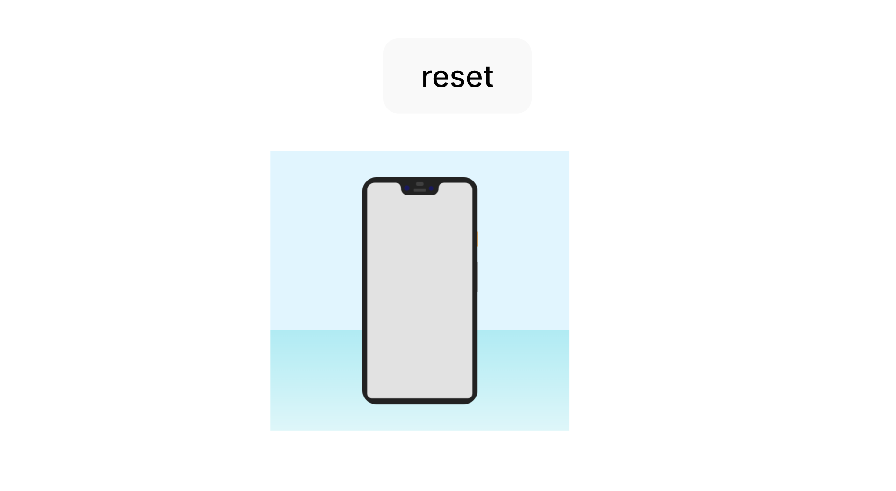

# sensors-orientation



A draggable DOM component that simulates Orientation, similar to the browser devtools, and matches the behavior of the browser devtools.

# Usage

## Demo

```sh
yarn 

yarn demo
```

## Install

```
yarn add orientation
```

## Use in Vue
```ts
import { ref, onMounted } from 'vue'
import registerOrientation from 'sensors-orientation'
import 'sensors-orientation/dist/index.css'


const manager = ref(null)

function reset() {
    manager.value.resetDeviceOrientation();
}

// 生命周期钩子
onMounted(() => {
  manager.value = registerOrientation(document.querySelector('.orientation'));
  manager.value.onChangeDeviceOrientation(args=>{
    console.error('onChangeDeviceOrientation', args);
  })
})
```